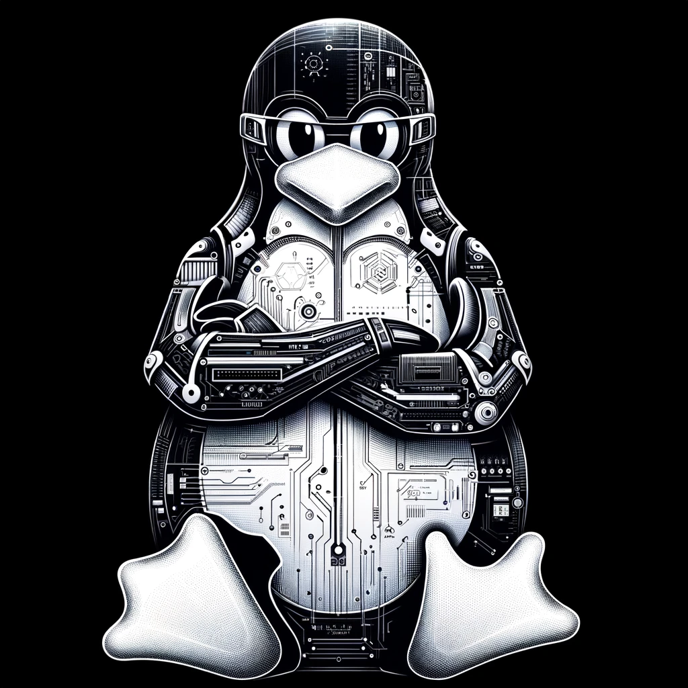

# 🚀 Welcome to CyberDepot — Your Ultimate Payload Repository

  

**Welcome to CyberDepot**, where cutting-edge penetration testing resources meet enthusiasts and professionals alike. Dive into our meticulously curated collection of payloads, scripts, and cheat sheets, designed to arm cybersecurity warriors with the tools they need. 🛡️

Elevate your hacking prowess with our arsenal, ranging from **reverse shells** to **Wi-Fi hacking** techniques. We provide state-of-the-art strategies in **cloud security** and **red team operations**, ensuring you're not just prepared, but ahead of the curve in the ever-evolving landscape of cyber threats.

## 🔍 Explore Our Diverse Categories

Discover our expansive range of categories, each meticulously crafted to enhance different aspects of your cybersecurity journey:

- [**Payloads and Reverse Shells**](http://127.0.0.1:8000/InfoSec-DB/CyberDepot/payloads/) 📡: Unleash advanced strategies to establish and maintain unauthorized access.
- [**WiFi Hacking and Password Cracking**](http://127.0.0.1:8000/InfoSec-DB/CyberDepot/wifi/) 🔓: Sidestep security measures to uncover hidden credentials.
- [**Google Dorks and Botnets**](http://127.0.0.1:8000/InfoSec-DB/CyberDepot/google-dorks/) 🕸️: Master sophisticated search techniques and harness botnets for potent network assaults.
- [**Cloud and Container Security**](http://127.0.0.1:8000/InfoSec-DB/CyberDepot/cloud/) ☁️: Navigate the intricacies of contemporary cloud and container technologies.
- [**Methodology and Red Team Operations**](http://127.0.0.1:8000/InfoSec-DB/CyberDepot/methodology/) 📊: Implement systematic methodologies for comprehensive security audits.

**CyberDepot** is not static; it evolves with the cyber landscape. Join us on our mission to bolster the digital realm, one innovative payload at a time.

---

> 🌐 **_CyberDepot_ is a dynamic, community-driven repository. We invite insights and contributions from cybersecurity enthusiasts worldwide. Let’s collaborate to shape a safer, more secure digital future._**
